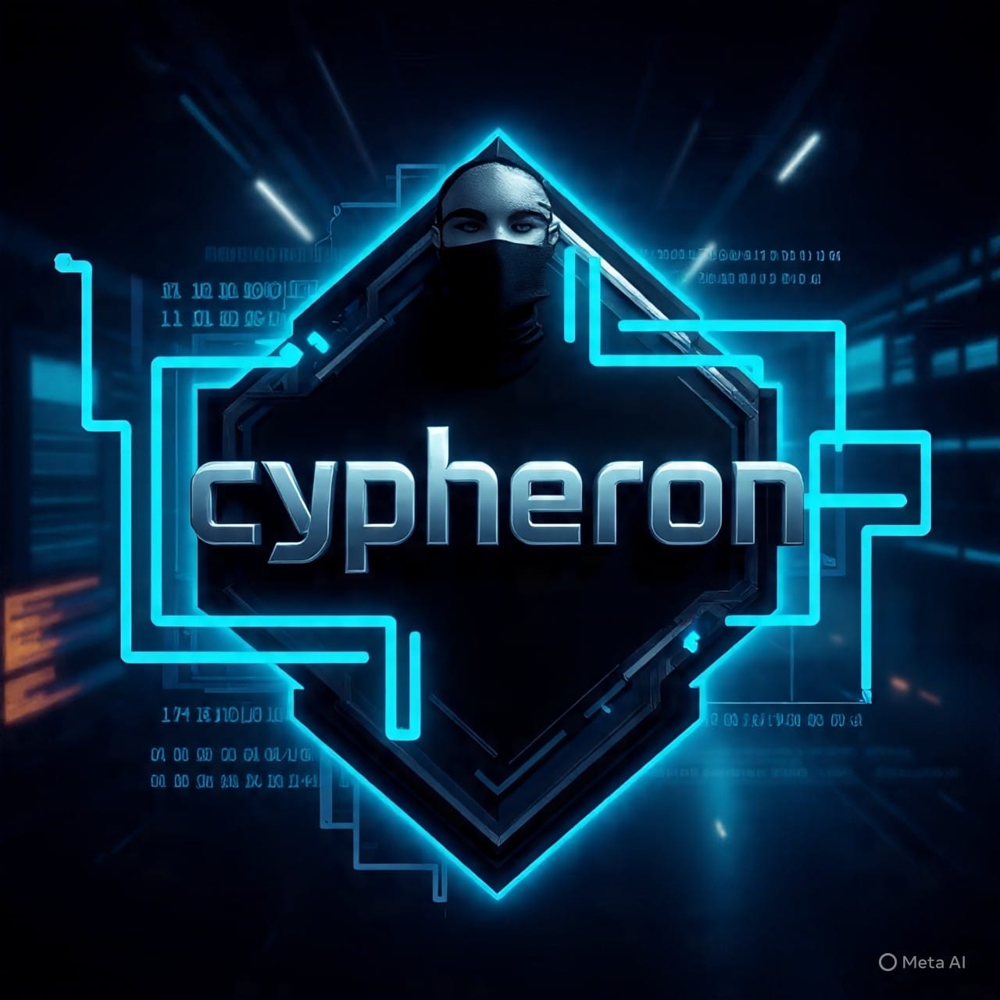

<!-- Glowing Header -->
<p align="center">
  
</p>

<h1 align="center">
  
</h1>

<!-- Banner Image -->
<p align="center">
  
</p>

---

## 📌 **How to Set Up Cypheron Bot**

### **Step 1: Clone the Repository**
```bash
git clone https://github.com/jeremi563/cypheron-whatsapp-bot.git
cd cypheron-bot
```

### **Step 2: Install Dependencies**
```bash
npm install
```

### **Step 3: Configure the Bot**
Open `config.js` and update your details:
```js
const config = {
  prefix: '!',
  botName: 'CYPHERON',
  owner: 'YOUR_NUMBER@s.whatsapp.net',
  autoBio: true,
  autoViewStatus: true,
  autoLikeStatus: true,
  autoReact: true,
}
```

### **Step 4: Run the Bot**
```bash
npm start
```

### **Step 5: Scan QR Code**
Scan the QR code that appears in your terminal with your WhatsApp and your bot is live!

---

## ✨ **Features**

<div align="center">

| Feature | Status |
|---|---|
| 🤖 Auto Bio with Live Clock | ✅ Active |
| 👁️ Auto View Status | ✅ Active |
| ❤️ Auto Like Status | ✅ Active |
| 💬 Auto Reply to Status | ✅ Active |
| ⚡ Auto React to Messages | ✅ Active |
| 👋 Auto Welcome Message | ✅ Active |
| 📡 Contact Presence Tracker | ✅ Active |
| 🔒 Owner Only Commands | ✅ Active |
| 👥 Group & Private Chat Support | ✅ Active |
| 🔄 Auto Reconnect | ✅ Active |

</div>

---

## 📋 **Commands**

### 🌍 Public Commands
<div align="center">

| Command | Description |
|---|---|
| !menu | Show all available commands |
| !ping | Check if bot is alive + response time |
| !hello | Greet the bot |
| !time | Get current time |
| !date | Get current date |

</div>

### 👑 Owner Commands
<div align="center">

| Command | Description |
|---|---|
| !autobio on/off | Toggle live auto updating bio |
| !autoreact on/off | Toggle auto react to messages |
| !autostatus | Manage status settings |
| !track add/remove/report | Track contact online presence |

</div>

---

## 📁 **Project Structure**
```
cypheron-bot/
├── 📁 assets/
│   ├── bot.jpg
│   └── startup.mp3
├── 📁 commands/
│   ├── autobio.js
│   ├── autoreact.js
│   ├── autostatus.js
│   ├── date.js
│   ├── hello.js
│   ├── menu.js
│   ├── ping.js
│   ├── time.js
│   └── track.js
├── 📄 config.js
├── 📄 cooldown.js
├── 📄 handler.js
├── 📄 index.js
├── 📄 presence.js
└── 📄 package.json
```

---

## 🚀 **Deploy**

<p align="center">
  <a href="https://render.com" target="_blank">
    
  </a>
  <a href="https://railway.app" target="_blank">
    
  </a>
</p>

---

## ⚠️ **Important Notes**

> 🔴 **Never share your `auth_info` folder** — it contains your WhatsApp session and anyone with it can access your account.

> 🔴 **Never push `auth_info` to GitHub** — it is already in `.gitignore` but double check before pushing.

> 🟡 **Use a secondary WhatsApp number** for running bots to keep your main number safe.

---

## 📢 **Stay Updated**

<p align="center">
  <a href="https://github.com/yourusername/cypheron-bot" target="_blank">
    
  </a>
</p>

---

## 📊 **Stats**

<p align="center">
  
  
</p>

---

## 🟢 **Status**

<p align="center">
  
  <br>
  <span style="font-size:1.2em; color:#00FF00;">Status: <b>🟢 ONLINE</b></span>
</p>

---

<!-- Footer -->
<p align="center">
  
</p>

<p align="center">
  <strong>CYPHERON BOT © 2026 | Built with ❤️ using Node.js & gifted-baileys</strong>
</p>